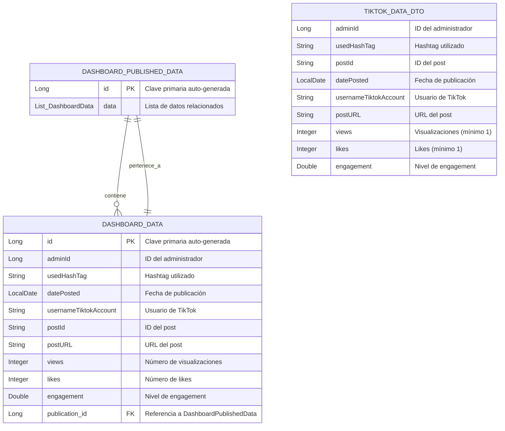

# Diagrama Entidad-Relación - Microservicio 4

## 📊 Diagrama ER

## 🔗 Relaciones

### Relación Principal:
- **DASHBOARD_PUBLISHED_DATA** (1) ←→ (N) **DASHBOARD_DATA**
  - **Tipo**: One-to-Many / Many-to-One
  - **Descripción**: Una publicación puede contener múltiples datos de dashboard
  - **Cardinalidad**: 1:N
  - **Clave foránea**: `publication_id` en DASHBOARD_DATA

### DTO:
- **TIKTOK_DATA_DTO** es un objeto de transferencia de datos
- No tiene relación directa con las entidades JPA
- Se usa para recibir/enviar datos de TikTok en las APIs

## 📋 Descripción de Entidades

### 🏢 DASHBOARD_PUBLISHED_DATA
- **Propósito**: Agrupa y gestiona las publicaciones de datos del dashboard
- **Atributos**: 
  - `id`: Identificador único de la publicación
  - `data`: Lista de todos los datos asociados a esta publicación

### 📊 DASHBOARD_DATA
- **Propósito**: Almacena los datos individuales de métricas de TikTok
- **Atributos principales**:
  - Datos del post (ID, URL, fecha, hashtag)
  - Métricas (visualizaciones, likes, engagement)
  - Información del usuario (adminId, usernameTiktokAccount)
  - Relación con la publicación padre

### 📦 TIKTOK_DATA_DTO
- **Propósito**: Transferir datos de TikTok entre capas de la aplicación
- **Validaciones**: 
  - Views y Likes deben ser mínimo 1
  - Campos obligatorios con @NotNull y @NotBlank
